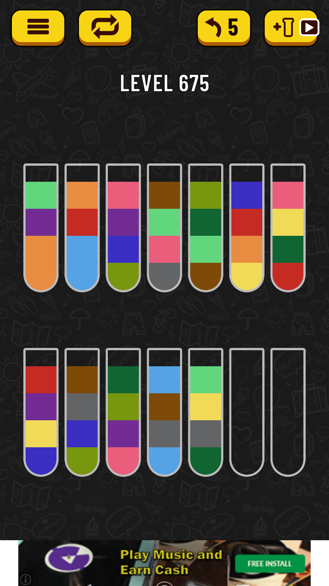
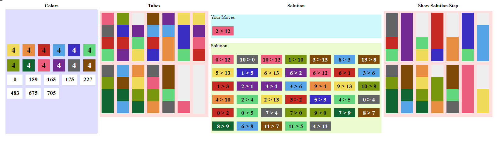

# Water Sort Puzzle Solver with Angular

## [Solve my Level](http://www.hatoka.de/testtube-solver/)

Solve each level of Water Sort Puzzle game with this [solver](http://www.hatoka.de/testtube-solver/).

## Project Info

The project was created to get hints for solving the Water Sort Puzzle game for [Android](https://play.google.com/store/apps/details?id=com.gma.water.sort.puzzle).

The application contains some predefined levels, but you are able to fill the test tubes by your self, also.
The solver does a brute force and may not found the best solution.

This application is written with [Angular](https://angular.io/docs) and [@ngrx/store](https://ngrx.io/guide/store). Any kind of improvements are welcome, please add a feature wish or feature branch. Especially, the design would like to be improved.

Another solver by [Ed Riccardi](https://github.com/kuking/WaterSortPuzzleSolver) is using the GO language.

## Development server

Run `ng serve` for a dev server. Navigate to `http://localhost:4200/`. The app will automatically reload if you change any of the source files.

### How to use it
* select a level like 705 or
* select level 0 and click at each color above to fill it test tube by test tube- the number inside of the color box show, how often do you use the color
- click on the solution section to start the solver
- click a test tube and the target test tube for making your own move like in the game
- click on a move (your or solution) to see on the right hand side the test tubes after that move.

## Build

Run `ng build` to build the project. The build artifacts will be stored in the `dist/` directory. Use the `--prod` flag for a production build.

## Next Steps

- create build and test pipelines
- provide a hosted application for using this app in a browser without any development environment.
